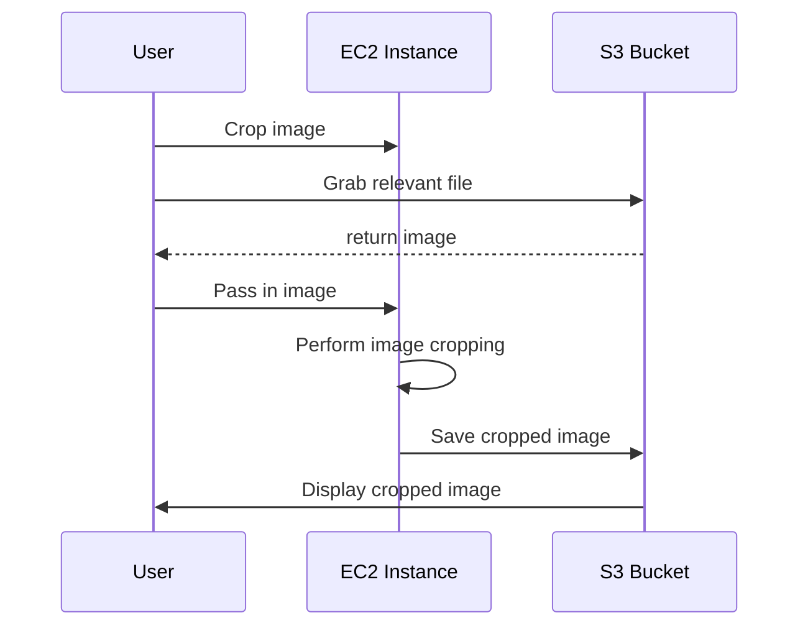

# Architecture

## Overview

The software is divided into 3 major portions: the UI, an S3 bucket, and an AWS EC2 instance:

- UI - What the user sees and interacts with.
- S3 Bucket - Stores project assets and work in progress files.
- EC2 Instance - Server with a Docker container that holds the Flask backend. Performs the video and image processing.

When a user wants to perform a specific action on the image/video, the relevant file will be pulled from the S3 bucket and passed into the backend (on the EC2 instance). The backend will perform the image/video processing and then return the resulting image/video back to the S3 bucket and the UI will display the updated image.

An example of how all 3 components interact with each other when a user wants to crop an image:



## UI

- Using react.js 
- Using [@material-ui/core](https://www.npmjs.com/package/@material-ui/core) for components

## Logic

- Using Pillow for image processing and MoviePy for video processing
  - Check [resources](#python) for links to documentation
- Using requirements.txt to track required packages.

## AWS

### S3

Files within the S3 bucket will be organized as such:

```
.
└── _username/
│   ├── _video_projects/
│   │   ├── _assets/
│   │   │   ├── example_audio.mp3
│   │   │   └── example_video.mp4
│   │   └── working_copy.mp4
│   └── _image_projects/
│       ├── _assets/
│       │   └── example_image.png
│       └── working_copy.png
└── _other_username/
    └── [same internal file structure as _username]
```

Uploading and import assets to and from the S3 bucket is handled by ```AssetManager``` in ```asset_manager.py```.


## Resources

### JavaScript/CSS

- [Selectors and Visual Rules CheatSheet](https://www.codecademy.com/learn/learn-css/modules/learn-css-selectors-visual-rules/cheatsheet)
- [React YouTube Tutorial](https://www.youtube.com/watch?v=QFaFIcGhPoM&list=PLC3y8-rFHvwgg3vaYJgHGnModB54rxOk3&index=2)

### Python

- [MoviePy Docs](https://moviepy.readthedocs.io/en/latest/index.html)
- [Pillow Docs](https://pillow.readthedocs.io/en/stable/reference/index.html)

### Git

- [Git CheatSheet](https://training.github.com/downloads/github-git-cheat-sheet/)
- [Git Visual CheatSheet](https://ndpsoftware.com/git-cheatsheet.html#loc=workspace;)
